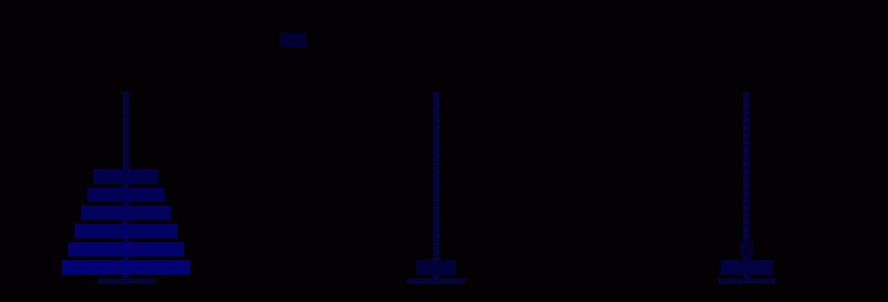

# Watch the hanoi towers move



What is a tower of hanoi you may ask? See
[wikipage](https://en.wikipedia.org/wiki/Tower_of_Hanoi)

This was a first programming project assignment long time ago. Please
don't judge the code too harshly :)

## Dependencies

I managed to run it with `Freepascal`. You also need the `libxxf86dga`
library.

## Building

Just say:
```
make
```
